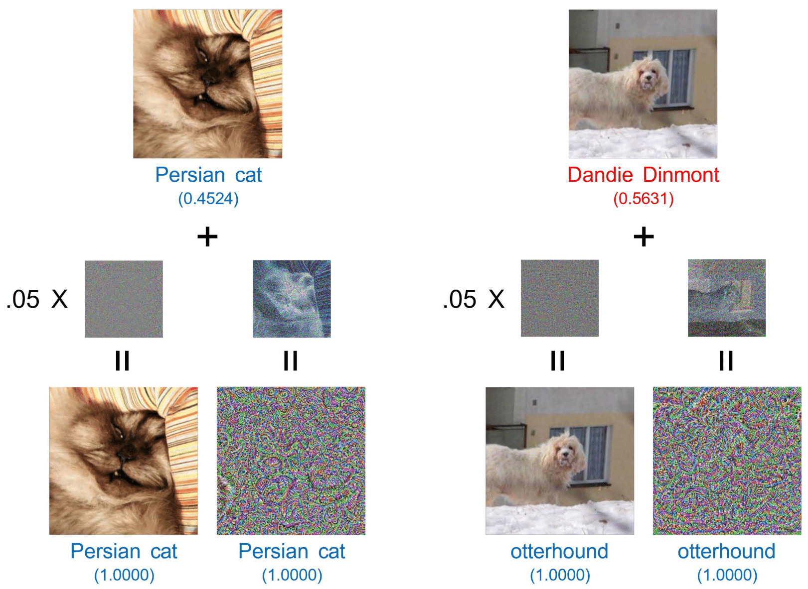

# Amicable Aid: Perturbing Images to Improve Classification Performance



This is the official repository of the ***Amicable Aid***,
a novel paradigm where the concept of image perturbation can benefit classification performance,
which is explained in the following paper.

- J. Kim, J.-H. Choi, S. Jang, J.-S. Lee. Amicable aid: perturbing images to improve classification performance. IEEE Int. Conf. Acoustics, Speech and Signal Processing (ICASSP), Jun. 2023\
[[**arXiv**]](https://arxiv.org/abs/2112.04720)

---

## Usage

To use the PyTorch-based implementation of the amicable aid <sup>[**src**](https://github.com/yupeeee/PyTools/blob/main/src/yupeeee_pytools/attacks/ifgsm.py)</sup>,
download the [**yupeeee-pytools**](https://github.com/yupeeee/PyTools) package using the following command
(**Manual installation of PyTorch is required**).

```
pip install yupeeee-pytools
```

### Example

```
import torch
from torchvision import models
from torchvision.transforms import Normalize

from yupeeee_pytools.attacks import IFGSM


model = models.resnet50(weights=models.ResNet50_Weights.IMAGENET1K_V1).cuda().eval()
normalizer = Normalize(mean=[0.485, 0.456, 0.406], std=[0.229, 0.224, 0.225])

ifgsm = IFGSM(
    model=model,
    epsilon=10,
    iteration=100,
    aid=True,
    normalizer=normalizer,
    clip_per_iter=True,
    use_cuda=True,
)

image = torch.rand(size=(1, 3, 224, 224)).to(torch.float32)
target = torch.Tensor([0]).to(torch.int64)

_image = ifgsm(
    data=image,
    targets=target,
    verbose=True,
)
```